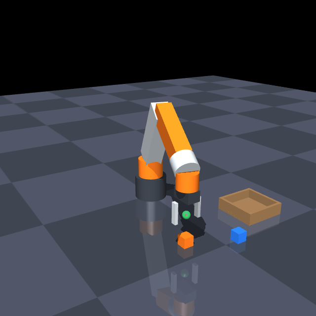

# Hand-Controlled Robot Arm

Real-time teleoperation of a simulated 6-DOF robot arm using nothing but a laptop webcam. Your hand is the controller: move it in the air and the arm mirrors you, pinch to grip, make a fist to clutch. No hardware required.

**▶ Live browser demo: link coming soon** — no install, video never leaves your machine.

<p align="center">
  
</p>

> **Demo video goes here** — record with `python -m handarm` running, screen-capturing the split-screen window while picking up a cube and dropping it in the tray.

## How it works

```
webcam ──▶ hand pose estimation ──▶ pose-to-command mapping ──▶ IK solver ──▶ physics sim
 30 fps     MediaPipe HandLandmarker    camera → robot space      damped        MuJoCo
            21 keypoints + world 3D     One Euro filtering        least squares  500 Hz
                    │                                                              │
                    └────────────── unified split-screen display ◀────────────────┘
                                    skeleton overlay + latency HUD
```

Per frame, the pipeline:

1. **Hand pose estimation** (`hand_tracker.py`, `pose_features.py`) — MediaPipe's HandLandmarker extracts 21 keypoints in both normalized image coordinates and metric hand-centered 3D. Pure-numpy geometry turns those into a palm orientation frame, a pinch ratio, and per-finger curl states.
2. **Mapping** (`mapping.py`) — palm position in the image maps to the arm's (y, z); apparent hand size maps to reach depth (x); palm rotation *relative to a calibrated reference* maps to end-effector orientation, clamped to a safe tilt cone. Targets are clamped to the reachable workspace box. The depth estimate is the ratio of the palm's image-plane extent to its world-space extent projected onto the same plane, which cancels foreshortening: tilting your palm no longer reads as reaching. Releasing a clutch re-anchors both maps so the arm resumes from where it froze.
3. **Filtering** (`filters.py`) — One Euro filters smooth the position and orientation targets (heavy smoothing at rest for zero jitter, cutoff opening with speed during fast moves for low lag). Gestures are time-debounced so a single misdetected frame can neither clutch nor grab.
4. **Inverse kinematics** (`ik.py`, `kinematics.py`) — a damped-least-squares (Levenberg–Marquardt) solver computes the six joint angles for the target pose. Manipulability-adaptive damping keeps steps bounded near singularities, every iterate is clamped to joint limits, and warm-starting from the previous frame plus per-iteration step clamps keep consecutive solutions continuous. Solves in ~0.5 ms.
5. **Physics** (`sim.py`, `assets/scene.xml`) — a hand-authored 6R arm (yaw/pitch/pitch/roll/pitch/roll wrist cluster) with a parallel-jaw gripper runs in MuJoCo at 500 Hz with position-servo actuators and gravity compensation on the links. The scene includes two cubes and a tray for pick-and-place.
6. **Display** (`overlay.py`, `app.py`) — one window: webcam feed with skeleton overlay on the left, the simulation on the right, with a HUD showing FPS, per-stage latency, IK convergence, and gripper state.

## Quickstart

Requires Python 3.10–3.12 (MediaPipe constraint) and a webcam.

```bash
python3.11 -m venv .venv
source .venv/bin/activate
pip install -r requirements.txt
python -m handarm
```

On first run, grant camera access to your terminal when macOS asks. Hold your open hand up, palm toward the camera, and keep it still for half a second — that pose becomes the neutral reference (press `c` any time to re-zero).

## Browser demo (no install)

The same pipeline also runs entirely in the browser — no Python, no downloads for the viewer, and the video never leaves your machine (MediaPipe's wasm and hand-landmarker model are vendored under `web/public/` and served same-origin):

```bash
cd web
pnpm install
pnpm dev   # open the printed localhost URL, click "Enable camera & start"
```

`web/` is a TypeScript port of the math core (FK, damped-least-squares IK, camera→robot mapping, One Euro filtering, pose features) with Three.js rendering and Rapier physics standing in for MuJoCo. Gestures work the same as below; keyboard shortcuts are `c` (calibrate), `o` (orientation toggle), `f` (freeze), `x` (reset scene). Cubes glow when the open gripper is within grasp range, and a floor ring under the tool gives a depth cue. `pnpm test` runs the vitest suite mirroring the Python tests; `pnpm build` type-checks and produces a static bundle (a 9 kB landing shell; the engine loads when you press start, with a download progress bar for the hand model).

**No camera? Press "Watch it run".** An autopilot picks up each cube and drops it in the tray through the very same controller, IK solver, and physics the hand drives — it just feeds scripted Cartesian targets instead of a palm. The hand-tracking model isn't downloaded in this mode. "Enable camera & take over" switches to live control mid-run. The Python app has the same thing: `python -m handarm --autopilot`, where the grasp is a real friction contact in MuJoCo.

The page ships a same-origin Content-Security-Policy, so the "video never leaves your machine" claim is enforced by the browser, not just promised. `pnpm build` writes a fully static `web/dist` that any static host can serve; set `BASE_PATH=/<subpath>/` only if you serve it from a subdirectory.

Two deliberate differences from the Python app. The browser mapping is **view-consistent with the mirrored camera preview** — move your hand right and the arm moves screen-right, and wrist roll/yaw follow the same on-screen sense. `web/src/mapping.ts` uses an intentionally improper (det = −1) camera→robot axis map to get this; `handarm/mapping.py` keeps the opposite convention because the MuJoCo viewer sits on the other side of the scene. The browser also treats the operator's forward as the robot's forward: reaching toward the camera **extends** the arm, where `handarm/mapping.py` retracts it. The mirrored sense is the one first-time visitors fight, and in the browser scene the arm's camera sits out front, so an extending tool looms larger on screen just as the hand does in the preview.

## Controls

| Gesture | Action |
|---|---|
| Move hand left/right/up/down | End effector follows in the arm's y/z plane |
| Move hand toward/away from camera | Arm reaches out / pulls back (depth from hand's apparent size) |
| Tilt/rotate palm | End-effector orientation follows (relative to calibration) |
| Pinch (thumb + index) | Close gripper — aperture tracks the pinch distance |
| Fist (thumb tucked or not) | Clutch: freezes arm **and gripper** so you can move your hand somewhere comfortable |
| Open hand after fist | Resume tracking **from where the arm froze** — the maps are re-anchored to your hand's new position. If you were holding an object, the grasp stays latched until you pinch again, so releasing the clutch never drops your payload |

| Key | Action |
|---|---|
| `c` | Take the current hand pose as neutral (re-zero orientation, depth, and clutch offset) |
| `o` | Toggle orientation control (position-only when off) |
| `f` | Manual freeze toggle |
| `r` | Start/stop recording a demonstration |
| `x` | Reset the scene |
| `q` / Esc | Quit |

Record a manipulation with `r`, then replay it: `python -m handarm --replay recordings/demo-<stamp>.jsonl` — a preview of learning-from-demonstration workflows. `python -m handarm --autopilot` runs the scripted pick-and-place with no camera (`f` freezes, `x` resets, `q` quits).

## The interesting part: the IK solver

6-DOF IK has no closed-form solution path that handles limits and singularities for free; this project solves it numerically each frame:

- **Damped least squares**: `dq = Jᵀ(JJᵀ + λ²I)⁻¹ e`, with the 6×6 geometric Jacobian from MuJoCo's `mj_jacSite` on a scratch model (the live sim state is never touched by solver iterations).
- **Singularity robustness**: manipulability `w = √det(JJᵀ)` is monitored on the raw Jacobian; as the arm approaches a singular configuration (e.g., full extension) extra damping ramps in smoothly, trading a little tracking error for bounded joint velocities instead of the wild spins a plain pseudo-inverse produces.
- **Joint limits**: every iterate is clamped to the model's joint ranges, so the solver only explores feasible space.
- **Continuity**: per-frame solves warm-start from the current configuration with clamped task-space error and step size, so the arm never snaps between IK branches. Cold-start solves (`restarts=n`) add an aimed-base-yaw seed and random restarts for global coverage.

## Latency

Measured on an M-series MacBook (`test_realtime_budget` enforces the budget in CI):

| Stage | Time |
|---|---|
| Hand detection (MediaPipe, VIDEO mode) | ~10–15 ms |
| Mapping + filtering + IK solve | ~0.6 ms |
| Physics (1/30 s of 500 Hz MuJoCo) | ~0.2 ms |
| Sim render (640 px offscreen) | ~2 ms |

End-to-end motion-to-motion latency is dominated by camera exposure + detection; the control side is effectively free. The HUD displays live per-stage numbers.

## Tests

```bash
python -m pytest tests/ -q
```

The suite (71 Python tests, 60 vitest) covers the quaternion math, filters, gesture geometry (including a thumb-tucked fist and tilt-invariant depth), camera-to-robot mapping and clutch rebasing, IK accuracy / joint limits / singularity behavior / smooth tracking, the controller state machine (calibration gate, debounce, clutch resume, tracking lag on a fast sweep), sim actuation, a full headless **pick-and-place integration test** that grasps a cube, lifts it, transports it, and releases it through the same code path the live loop uses, and the **autopilot** end to end on both sides (every waypoint reachable, both cubes land in the tray, bounded grasp retries, freeze pauses the script). `.github/workflows/ci.yml` runs both suites on every push.

## From simulation to hardware

The architecture keeps the perception → mapping → IK stack independent of the plant. `ArmSim` exposes exactly two commands — `set_joint_targets(q)` and `set_gripper(opening)` — so swapping in a real arm means implementing that same interface over a serial/CAN/ROS bridge and tuning the joint limits in one config file. This is the software stack of a real teleoperation system, running in simulation.

## Project layout

```
handarm/
  app.py            real-time loop, HUD, record/replay, autopilot loop
  autopilot.py      scripted pick-and-place (no camera), shared with web/
  hand_tracker.py   MediaPipe HandLandmarker wrapper
  pose_features.py  palm frame, pinch, finger curl (pure numpy)
  mapping.py        camera-space → robot-space, calibration
  filters.py        One Euro, quaternion low-pass
  ik.py             damped least squares solver
  kinematics.py     FK / Jacobians (MuJoCo scratch model)
  sim.py            MuJoCo world: arm, gripper, cubes, tray
  overlay.py        skeleton overlay, HUD, split-screen compositor
  latency.py        rolling per-stage profiler
  recorder.py       JSONL trajectory record / replay
assets/scene.xml    6-DOF arm + gripper + scene (MJCF)
tests/              full suite, all headless
web/
  src/              browser demo: TS port of the math core, Three.js scene,
                    Rapier physics, MediaPipe hand tracking
  tests/            vitest suite mirroring tests/
  public/           vendored MediaPipe wasm + hand-landmarker model
```

Release notes live in [CHANGELOG.md](CHANGELOG.md); known gaps and planned work in [TODOS.md](TODOS.md); the original project brief in [docs/brief.md](docs/brief.md).
